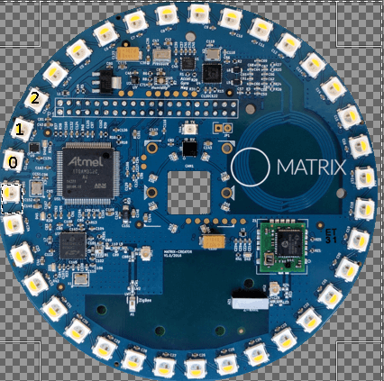

# Everloop

The Everloop driver controls the LED array of the MATRIX Creator.
It follows the [MALOS protocol](../README.md#protocol).

### 0MQ Port
```
20021
```

### Protocol buffers

There is a JavaScript example for the following details so you can skip this section if you're not familiar with protocol buffers and
if you are impatient and want to see the LEDs working as soon as possible.

The messages used by this driver are defined in [driver.proto](https://github.com/matrix-io/protocol-buffers/blob/master/malos/driver.proto).

```
message EverloopImage {
  repeated LedValue led = 1;
}
```


The message `EverloopImage` needs to have exactly 35 messages of type `LedValue` in the repeated field `led`,
corresponding to each of the LEDs present in the Creator. The LEDs are counted starting from the left, clock-wise
as shown in the picture.



The message LedValue holds the color values for each LED and each value is in the range [0, 255].

```
message LedValue {
  uint32 red = 1;
  uint32 green = 2;
  uint32 blue = 3;
  uint32 white = 4;
}
```

### Keep-alives

This driver doesn't need keep-alive messages as it doesn't send data to the subscribed programs.

### Errors

This driver report errors when an invalid configuration is sent.

### Read

This driver doesn't send any data to a subscribed program.

### JavaScript example

This section provides an enhanced description of the relevant parts of the [sample source code](../src/js_test/test_everloop.js).
Some variables used below are defined in the example (for instance matrixMalosBuilder).

In order to set the LEDs of the Creator you need to perform the following steps.

#### Create a configuration that will be sent to the Everloop driver.

    var config = new matrixMalosBuilder.DriverConfig

#### Create the object that will hold the LED configuration.

    config.image = new matrixMalosBuilder.EverloopImage

#### Set the LED state of each LED in the board.

The following steps needs to be repeated 35 times, once per LED.

##### Create the object that holds the LED state

First, create the object.
 
    var ledValue = new matrixMalosBuilder.LedValue

Now fill out the state of a given led by calling the following functions on ledValue.
Each of the following functions receives an integer in the range [0, 255].

| Function      |   Objective   |
| ------------- |:-------------:|
| setRed        | Set value of red component  |
| setGreen      | Set value of green component |
| SetBlue       | Set value of blue component |
| SeWhite       | Set value of white component |

That is:

    ledValue.setRed(red_value)
    ledValue.setGreen(green_value)
    ledValue.setBlue(blue_value)
    ledValue.setWhite(white_value)

##### Send the configuration to the Everloop driver

    config.image.led.push(ledValue)

#### All the steps combined

The following snippet will make all the greens display the green color.

    var config = new matrixMalosBuilder.DriverConfig
    config.image = new matrixMalosBuilder.EverloopImage
    for (var j = 0; j < 35; ++j) {
      var ledValue = new matrixMalosBuilder.LedValue
      ledValue.setRed(0);
      ledValue.setGreen(30)
      ledValue.setBlue(0)
      ledValue.setWhite(0)
      config.image.led.push(ledValue)
    }
    configSocket.send(config.encode().toBuffer())
